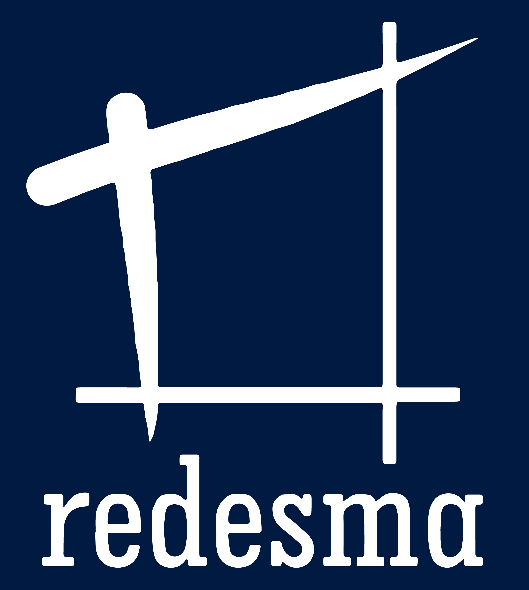

## Tentang Redesma Daily

Redesma Daily merupakan aplikasi perusahaan Redesma yang dipergunakan untuk melakukan presensi karyawan menggunakan QR Code, Aplikasi ini dikembangkan menggunakan bahasa pemrograman PHP dan Framework Laravel, dan utnuk menyimpan data digunakan MYSql Database
